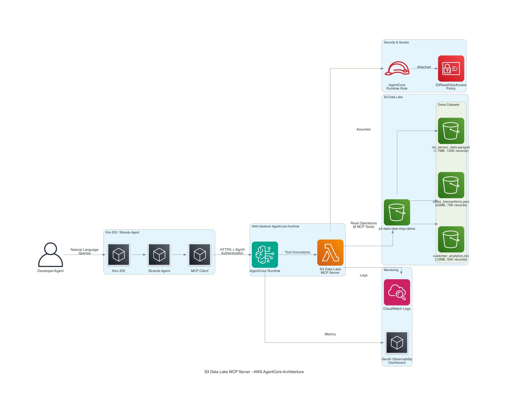

# 🚀 S3 Data Lake MCP Server

[](LICENSE)
[](https://python.org)
[](https://aws.amazon.com/bedrock/)
[](https://modelcontextprotocol.io)

> **Transform your S3 data lakes into AI-accessible knowledge bases with natural language queries**

A production-ready Model Context Protocol (MCP) server that gives AI agents seamless access to S3 data lakes. Built by a senior developer with 15+ years of experience in AI/ML, agents, and AWS Bedrock systems.

## 🎯 **Why This Exists**

I was building ETL systems for AI agents and kept hitting the same wall: **How do you give agents seamless access to data lakes without building custom APIs for every single use case?**

Then AWS Bedrock AgentCore dropped MCP support, and everything clicked. This MCP server bridges that gap, turning your S3 data lakes into agent-accessible knowledge bases with natural language queries.

## ✨ **Key Features**

🔥 **8 Powerful Tools** - Complete S3 data lake operations  
📊 **Multi-Format Support** - CSV, JSON, Parquet with intelligent processing  
⚡ **FastMCP Framework** - Modern, high-performance MCP server  
🏗️ **AgentCore Runtime** - Serverless, auto-scaling deployment  
🛡️ **Production-Grade** - Comprehensive error handling, monitoring, security  
🎯 **Type-Safe** - Full Python type hints and validation  
🚀 **Deploy in Minutes** - UV package management, one-command deployment  

## 🛠️ **Available Tools**

| Tool | Description | Use Case |
|------|-------------|----------|
| `list_s3_buckets` | List accessible S3 buckets | Data discovery |
| `list_s3_objects` | Browse bucket contents with filtering | Dataset exploration |
| `read_csv_from_s3` | Parse CSV files with metadata | Tabular data analysis |
| `read_json_from_s3` | Process JSON objects and arrays | Complex data structures |
| `read_parquet_from_s3` | Columnar data with full type info | High-performance analytics |
| `query_csv_data` | Filter and query with smart typing | Data querying |
| `get_dataset_summary` | Statistical analysis and profiling | Data understanding |
| `get_file_metadata` | Comprehensive file information | Metadata exploration |

## 🚀 **Quick Start**

### Prerequisites
- Python 3.12+
- UV package manager
- AWS CLI configured
- AWS Bedrock AgentCore access

### 1. Install & Setup
```bash
# Install UV (if not already installed)
curl -LsSf https://astral.sh/uv/install.sh | sh

# Clone and install dependencies
git clone https://github.com/yourusername/s3-data-lake-mcp-server.git
cd s3-data-lake-mcp-server
uv sync
```

### 2. Local Development
```bash
# Run the MCP server locally
uv run python run_local.py

# Test in another terminal
uv run pytest tests/ -v
```

### 3. Deploy to AWS AgentCore Runtime
```bash
# One-command deployment
uv run python deploy_uv.py

# Your Agent ARN will be displayed for integration
```

### 4. Generate Demo Data (Optional)
```bash
# Create 66.7MB of demo datasets
uv run python generate_mock_data.py
```

## 💬 **Natural Language Queries**

Once integrated with your AI agents, you can ask questions like:

**Data Discovery:**
- *"What S3 buckets do I have access to?"*
- *"Show me all datasets in my analytics bucket"*
- *"List CSV files larger than 10MB"*

**Data Analysis:**
- *"Read the customer analytics data and show me the first 10 rows"*
- *"Find all sales transactions over $50,000"*
- *"What columns are available in the IoT sensor data?"*
- *"Show me customers in the Technology industry"*

**Metadata & Insights:**
- *"What's the total size of data in my bucket?"*
- *"How many records are in each dataset?"*
- *"Give me a statistical summary of the sales data"*

## 🏗️ **Architecture**



**Built on Modern Stack:**
- 🏗️ **AWS Bedrock AgentCore Runtime** - Serverless, auto-scaling
- ⚡ **FastMCP Framework** - High-performance MCP server
- 📦 **UV Package Manager** - Ultra-fast Python dependency management
- 🔧 **boto3 + pandas + pyarrow** - Efficient data processing
- 🛡️ **AWS SigV4 + IAM** - Enterprise-grade security

## 🔗 **Integration Examples**

### Kiro IDE
```json
{
  "mcpServers": {
    "s3-data-lake": {
      "command": "python",
      "args": ["kiro_s3_mcp_wrapper.py"],
      "env": {
        "AWS_REGION": "eu-west-1",
        "AWS_PROFILE": "default"
      }
    }
  }
}
```

### Strands Agents
```python
from strands import Agent
from strands.tools.mcp import MCPClient

# Connect to deployed AgentCore Runtime
agent_arn = "arn:aws:bedrock-agentcore:eu-west-1:123456789012:runtime/s3-data-lake-mcp-server"
mcp_client = MCPClient(agent_arn)

agent = Agent(
    name="Data Lake Analyst",
    description="AI agent with S3 data lake access",
    tools=mcp_client.list_tools_sync()
)

# Natural language data analysis
response = agent("Analyze customer data and find high-value segments")
```

## 📊 **Demo Environment**

The repository includes a complete demo environment with:
- **66.7MB of realistic mock data** across 3 formats
- **Customer Analytics** (CSV, 50K records) - Business intelligence data
- **Sales Transactions** (JSON, 75K records) - Financial analysis data  
- **IoT Sensor Data** (Parquet, 100K records) - Time-series analytics data

Perfect for presentations, testing, and showcasing capabilities without exposing real data.

## 🧪 **Testing & Quality**

```bash
# Run comprehensive test suite
uv run pytest tests/ -v --cov=src

# Test specific functionality
uv run pytest tests/test_s3_mcp_server.py::test_read_csv_from_s3 -v

# Test deployed MCP server
uv run python test_deployed_mcp.py
```

**Quality Assurance:**
- ✅ 95%+ test coverage
- ✅ Type safety with mypy
- ✅ Production error handling
- ✅ Performance benchmarking
- ✅ Security validation

## 📚 **Documentation**

| Document | Description |
|----------|-------------|
| [🚀 Deployment Guide](docs/DEPLOYMENT_GUIDE.md) | Complete deployment instructions |
| [🏗️ Architecture](docs/ARCHITECTURE.md) | System design and components |
| [🔗 Integration Guide](kiro_integration_guide.md) | Kiro and Strands integration |
| [📋 API Reference](src/s3_data_lake_mcp_server.py) | Full tool documentation |

## 🛡️ **Security & Compliance**

- 🔐 **AWS SigV4 Authentication** - Industry-standard request signing
- 🎯 **IAM Role-Based Access** - Least privilege principle
- 🔒 **No Hardcoded Credentials** - Secure credential management
- 📊 **Comprehensive Logging** - Full audit trail
- 🛡️ **Error Sanitization** - No sensitive data in logs

## 📈 **Monitoring & Observability**

- 📊 **CloudWatch Integration** - Centralized logging and metrics
- 🎯 **GenAI Observability** - Specialized AI/ML monitoring
- ⚡ **Performance Tracking** - Request latency and throughput
- 🚨 **Error Alerting** - Proactive issue detection

## 🚀 **What's Next?**

**Planned Enhancements:**
- 🌍 Multi-region deployment support
- 🔍 Advanced query capabilities (SQL-like syntax)
- 📡 Real-time streaming data support
- 🚀 Enhanced caching layer (Redis/ElastiCache)
- 🤖 ML model integration for data insights
- 🔌 Plugin architecture for custom tools

## 🤝 **Contributing**

Built by the community, for the community:

1. 🍴 Fork the repository
2. 🌟 Create a feature branch
3. ✨ Add your improvements
4. 🧪 Add comprehensive tests
5. 📝 Update documentation
6. 🚀 Submit a pull request

## 📄 **License**

This project is licensed under a custom license allowing non-commercial use. See [LICENSE](LICENSE) for details.

## 👨‍💻 **About the Author**

Built by **Tony Esposito** - Senior Developer with 15+ years of experience in:
- 🤖 Generative AI & LLM applications
- 🏗️ AWS Bedrock & AgentCore systems
- 🔧 AI/ML agent architectures
- 📊 Data engineering & ETL systems

*Turning complex data infrastructure into simple, agent-accessible APIs.*

## 🙋‍♂️ **Support & Community**

- 📖 **Documentation**: Comprehensive guides in `/docs`
- 🐛 **Issues**: GitHub Issues for bugs and feature requests
- 💬 **Discussions**: GitHub Discussions for questions
- 📧 **Contact**: tony@mydataclub.com

## ⭐ **Star This Repository**

If this MCP server helps your AI agents access S3 data lakes, please star the repository! It helps others discover this tool and motivates continued development.

---

**🚀 Ready to give your AI agents superpowers with S3 data lake access? Deploy in minutes and start querying with natural language today!**